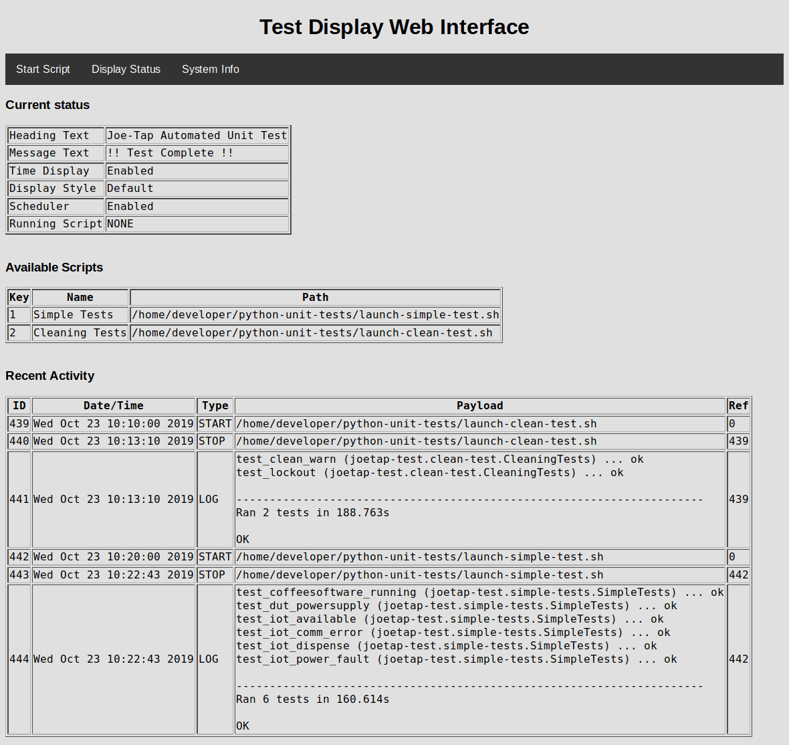

# TestDisplay Application

## Overview

The *TestDisplay* application is an application used to display the current status of automated testing on the devices touch-screen. It is designed to run on a Raspberry Pi SBC with the **Qt** software installed.

The primary objective of *TestDisplay* is to spawn python unit-tests through shell scripts. The results of the tests are stored in a database backend (currently using `PostgreSQL`).

## Features

The *TestDisplay* application boasts the following features:

* Customizable user interface elements
    * Font Family
    * Font Size
    * Font Color
* Controlled through TCP/IP port.
    * Commands to set heading and message text.
    * Commands to inquire status.
    * Commands to start/stop test scripts.
* Web interface
    * Ability to start/stop tests.
    * Display status of running tests.
    * Display existing schedule.

## Compatability

The *TestDisplay* application has been successfully built on the following platforms:

* Ubuntu 18.04 running on x86_64
* Ubuntu 18.04 running on Arm (RasPi2 & 3)
* Partial support for Raspberry Pi running Yocto kernel.

Minimum supported Qt Version 5.10

**NOTE:** Database logging does not work for the Yocto build. The database drivers are not built and as a result the Qt database interface is unusable.

## Configuration

*TestDisplay* uses several files for configuration. These files are listed below:

### Files

| File | Description |
| ---- | ----------- |
| `~/.config/wunderbar/TestDisplay.conf` | General configuration file setting options. |
| `~/.testdisplay/schedule.xml` | Configure which scripts are run at which times on which day of the week.|
| `~/.testdisplay/scripts.xml` | Configure which scripts can be launched by key-press. |
| `~/.testdisplay/styles.xml` | Configure available styles (fonts, colors, etc.) |

`-TBD-`

## Database Backend

`-TBD-`

## Web Interface

The web interface runs, by default, listening on port `8080`.

Here is a sample of the display of the status page of the web interface.



## Control Port

The **TestDisplay** application opens a TCP/IP port (port 4321) and listens for commands in the form `'XXXX:[ARG]:[ARG...]'` where `XXXX` is the command followed by a *COLON* and then any arguments.

Commands will return a result, usually the string `OK` or `FAIL` to indicate whether the command completed successfully.

### Supported Commands

| COMMAND | DESCRIPTION | RESPONSE |
| ------- | ----------- | -------- |
| `HEAD:heading` | Set the heading to the string `heading` | `OK` |
| `MESG:message` | Set the message to the string `message` | `OK` |
| `QUIT:` | Close the current connection | `OK` |
| `TIME:[1\|0]` | Enable/Disable time display | `OK` |
| `REST:` | Reset the device to initial state | `OK` |
| `STYL:#` | Set the display style to index `#` | `OK` |
| `STAT:` | Get the status from the display | `STAT:heading:message:style_name:time_en:sched_en:script_run:script_name` |
| `RUNK:ch` | Run script corresponding to key `ch` | `OK` |
| `STOP:` | Stop running script by sending SIGINT signale | `OK` |
| `LIST:SCRIPT` | List all loaded scripts | list of elements in the form `ch:script_name:script_path` terminating in `OK` |
| `LIST:STYLE` | List all loaded styles | list of elements in the form `style_name:head_family:head_size:mesg_family:mesg_size:fg_color:bg_color` |
| `KILL:` | Kill the running **TestDisplay** instance | No response |
| `SCHED:[1\|0]` | Enable/Disable scheduler | `OK` |
| `TEXT:heading:message` | Set both heading and message with one command | `OK` |

## Python Driver

A driver for Python apps is provided.

### Installation

#### Generate the Python wheel file

```
$> cd python/module
$> python3 setup.py sdist bdist_wheel
```

The wheel file `testdisplay-0.0.1-py3-none-any.whl` will be found in the `dist` directory.

#### Install the wheel file

```
$> pip install testdisplay-0.0.1-py3-none-any.whl
```

### Example Code

```python
from sup.display_driver import DisplayDriver

    def main():
    import argparse

    parser = argparse.ArgumentParser()
    parser.add_argument('--server', type=str, default='localhost', help='Server to connect to')
    parser.add_argument('--port', type=int, default=4321, help='Port to connect to')

    opts = parser.parse_args()

    try:
        with DisplayDriver(host=opts.server, port=opts.port) as disp:
            try:
                disp.set_text('Joe-Tap Automated Unit Test',
                              'Connection Established')
                sleep(1)

                for x in range(0,3):
                    disp.set_message('Running \'Invalid Voltage\' test...')
                    sleep(4)
                    disp.set_message('Running \'Communication Down\' test...')
                    sleep(4)
                    disp.set_message('Running \'Dispense Liquid\' test...')
                    sleep(4)
                    disp.set_message('Running \'Low Pressure\' test...')
                    sleep(4)
                    disp.set_message('Running \'Lockout\' test...')
                    sleep(6)
                    disp.set_message('Running \'Clean Warn\' test...')
                    sleep(6)
            except KeyboardInterrupt as e:
                print('Quitting..')
                # Reset the display before exit...

            disp.reset()
    except ConnectionRefusedError:
        print('Unable to establish connection with remote display...')
    except BrokenPipeError as e:
        print('Remote display has disconnected unexpectedly...')

```


### Documentation
```
Help on module sup.display_driver in sup:

NAME
    sup.display_driver

CLASSES
    builtins.object
        DisplayDriver
    
    class DisplayDriver(builtins.object)
     |  Methods defined here:
     |  
     |  __enter__(self)
     |  
     |  __exit__(self, exc_type, exc_val, exc_tb)
     |  
     |  __init__(self, host='localhost', port=4321)
     |      Initialize self.  See help(type(self)) for accurate signature.
     |  
     |  close(self)
     |      Terminate connection to the TestDisplay application.
     |      :return:
     |  
     |  get_script_list(self) -> list
     |      Return a list of script objects
     |  
     |  get_status(self) -> object
     |      Get TestDisplay status.
     |      :return: Dictionary containing status.
     |  
     |  get_style_list(self) -> list
     |      Return a list of style objects
     |  
     |  open(self)
     |      Open the socket to communicate with the TestDisplay application.
     |      :return:
     |  
     |  reset(self) -> bool
     |      Reset TestDisplay application to default state.
     |      :return:
     |  
     |  set_heading(self, heading:str) -> bool
     |      Set the Test Display heading
     |      :param heading: Text to display
     |      :return: True on success, False on failure.
     |  
     |  set_message(self, message:str) -> bool
     |      Set the Test Display message
     |      :param message: Text to display
     |      :return: True on success, False on failure.
     |  
     |  set_text(self, heading:str, message:str) -> bool
     |      Set both heading and message in a single call.
     |      :param heading: Text for heading
     |      :param message: Text for message
     |      :return: True on success.
     |  
     |  set_time(self, status:bool) -> bool
     |      Enable/Disable time display.
     |      :param status: True to enable, False to disable.
     |      :return:
     |  
     |  ----------------------------------------------------------------------
     |  Data descriptors defined here:
     |  
     |  __dict__
     |      dictionary for instance variables (if defined)
     |  
     |  __weakref__
     |      list of weak references to the object (if defined)
     |  
     |  ----------------------------------------------------------------------
     |  Data and other attributes defined here:
     |  
     |  display_host = None
     |  
     |  display_port = 4321
     |  
     |  sock = None

FILE
    /home/muman/gitroot/TestDisplay-repo/python/module/sup/display_driver.py
```
